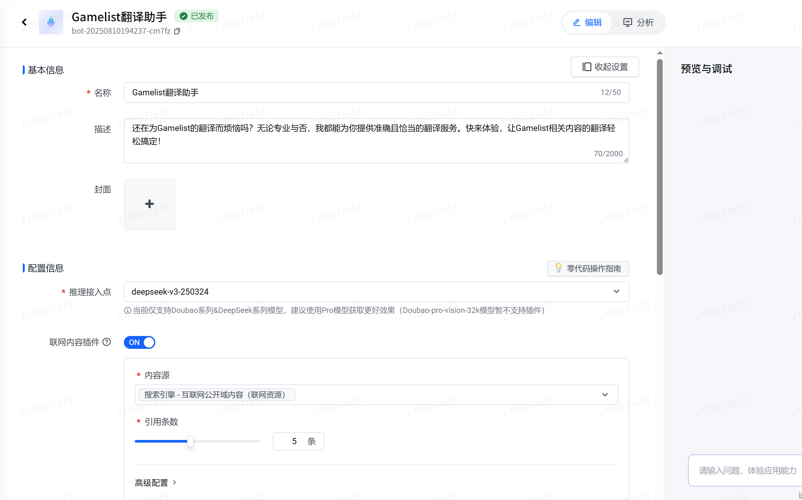

# Gamelist中文翻译工具（AI 大模型驱动版）

一个 Emulation Station 系统下的 gamelist.xml 文件的AI中文翻译脚本工具。调用AI大模型将 gamelist.xml 中的英文的游戏名称和游戏描述翻译为简体中文。可用于对 Batocera 和 Retrobat 模拟器的gamelis.xml游戏列表文件进行中文翻译。

项目地址：
https://github.com/hanb102400/GamelistToZh

## 使用步骤：

### 1. 注册豆包大模型API账号

首先注册你的大模型的API账号。

目前推荐使用 豆包火山引擎的deepseek-v3，搭配联网插件使用。

豆包是字节跳动发布的大模型，是字节在火山引擎基础上推出的一系列AI大模型产品，涵盖深度思考、视频生成、音乐创作等多模态能力。

**(1) 注册API账号：**

地址：https://www.volcengine.com/experience/ark

注册完成后，记住使用大模型的名称和API_KEY。


**(2) 开通大语言模型：**

地址：https://console.volcengine.com/ark/region:ark+cn-beijing/model/detail?Id=deepseek-v3

目前尝试了最适合的模型是 DeepSeek-V3。平均每一个游戏翻译时间在7秒左右。

开通模型后需要接入联网内容插件，否则游戏名称会翻译不准确。

目前豆包应该是开通大模型会送一定数量的免费token试用。


**(3) 创建智能体应用**

进入`火山方舟`——`我的应用页面`

点击`创建应用`——`选择零代码`——`选择单聊`

名称：输入Gamelist翻译
推理接入点：选择deepseek-v3
联网内容插件：开启，选择（搜索引擎-互联网公开域内容）
提示词输入如下：
```
       "你是一位专业的复古模拟游戏本地化翻译家，负责将游戏名称和描述翻译成简体中文。\n"
        "请遵守以下规则：\n"
        "1. 游戏名称优先使用中文官方译名或中文常用译名\n"
        "2. 游戏名称翻译后不要有《》书名号\n"
        "3. 游戏描述要流畅自然，保持原有段落结构\n"
        "4. 保留所有特殊符号和格式（如换行符、引号等）\n"
        "5. 技术术语（如游戏类型、机制）要准确翻译\n"
        "6. 翻译失败时返回空文本\n"
        "7. 返回结果为JSON内容，格式如下: {\"name_zh\": \"中文名称\", \"desc_zh\": \"中文描述\"}\n"
        "8. 返回结果直接只输出JSON内容，不要输出推理过程和引用"
```
其他内容不需要填写

如图




### 2. 下载脚本并修改配置

下载脚本的zip包到本地目录，并解压。

修改解压出来的GamelistToZh.bat文件，将下面的配置改为自己创建的应用和申请的账号。配置完成后保存。

配置说明：

> model：你的模型类型(填入应用)
>
> api_key： 你的API密钥

豆包火山引擎配置如下：
```
set "ai=doubao"					                    :: 请替换为你的实际模型产品
set "model=bot-20250810194237-cm7fz"        	    :: 请替换为你的实际模型类型
set "api_key=xxxxxxxxxxxxxxxxxxxxxxxxxxxxxxx"  		:: 请替换为你的实际API密钥
```

注意：解压出来的database目录是我自己用AI跑的中英文对照库。做缓存使用。你可能想用自己的模型跑，不需要使用我的已有翻译数据，可以删除这个目录内容。


### 3. 执行bat脚本翻译gamelist文件

打开Windows Powershell命令行，拖入解压出来的GamelistToZh.bat脚本文件，输入空格，拖入需要翻译的本地gamelist.xml文件，输入回车,即可执行脚本进行翻译。

翻译命令如图：


翻译完成信息打印：


### 4. 翻译效果展示

Retrobat加载翻译后的gamelist.xml文件效果如下：


截取一段原始内容和翻译后的对比

```
<game id="13983">
		<path>./dkong.zip</path>
		<name>Donkey Kong</name>
		<sortname>175 =-  Donkey Kong</sortname>
		<desc>Released in the arcades in 1981, Donkey Kong was not only Nintendo's first real smash hit for the company, but marked the introduction for two of their most popular mascots: Mario (originally "Jumpman") and Donkey Kong.
Donkey Kong is a platform-action game that has Mario scale four different industrial themed levels (construction zone, cement factory, an elevator-themed level, and removing rivets from girders) in an attempt to save the damsel in distress, Pauline, from the big ape before the timer runs out.  Once the rivets are removed from the final level, Donkey Kong falls, and the two lovers are reunited.  From there, the levels start over at a higher difficulty.
Along the way, Mario must dodge a constant stream of barrels, "living" fireballs, and spring-weights.  Although not as powerful as in other future games, Mario can find a hammer which allows him to destroy the barrels and fireballs for a limited amount of time.  Additionally, Mario can also find Pauline's hat, purse and umbrella for additional bonus points.
Donkey Kong is also notable for being one of the first complete narratives in video game form, told through simplistic cut scenes that advance the story.  It should also be noted that in versions of the game for early 1980's consoles, Donkey Kong only used 2-3 of the original levels, with the cement factory usually omitted.</desc>
		<rating>0.60</rating>
		<releasedate>19830101T000000</releasedate>
		<developer>Coleco Industries</developer>
		<publisher>CBS Electronics</publisher>
		<genre>Platform</genre>
		<genreid>257</genreid>
		<players>1</players>
	</game>
```


```
<game id="13983">
		<path>./dkong.zip</path>
		<name>大金刚</name>
		<sortname>175 =-  Donkey Kong</sortname>
		<desc>1981年，《大金刚》在街机平台发布，它不仅是任天堂公司首款真正意义上的爆款游戏，还首次引入了该公司最受欢迎的两位吉祥物：马力欧（最初名为“Jumpman”）和大金刚。
《大金刚》是一款平台动作游戏，玩家将操控马力欧攀爬四个不同的工业主题关卡（建筑工地、水泥厂、电梯主题关卡以及从大梁上移除铆钉的关卡），试图在计时器结束前从大猩猩手中救出遇险的少女宝琳。 一旦最终关卡的铆钉被全部移除，大金刚会坠落，两位恋人得以重逢。 之后，关卡将以更高难度重新开始。
途中，马力欧必须躲避源源不断的木桶、“活”火球和弹簧重物。 尽管不如后续游戏中强大，但马力欧可以找到一把锤子，在有限时间内摧毁木桶和火球。 此外，马力欧还能找到宝琳的帽子、钱包和雨伞以获得额外奖励分数。
《大金刚》还因是首批以电子游戏形式呈现完整叙事的作品之一而闻名，其通过简单的过场动画推动剧情发展。 还需注意的是，在20世纪80年代初的游戏机版本中，《大金刚》仅使用了原版中的2-3个关卡，水泥厂关卡通常被省略。</desc>
		<rating>0.60</rating>
		<releasedate>19830101T000000</releasedate>
		<developer>Coleco Industries</developer>
		<publisher>CBS Electronics</publisher>
		<genre>Platform</genre>
		<genreid>257</genreid>
		<players>1</players>
	</game>
```


## 一些不重要的说明

因为最近需要整理复古怀旧游戏的ROM，没找到好用的gamelist游戏列表中文翻译软件。本人也不太懂代码，出资49元找计算机系的学生抽空帮忙写了个python脚本工具。代码已经买断可以随意修改使用。

1. 首先需要你有一个AI大语言模型的账号，翻译脚本依赖AI大模型的API调用。
2. 目前支持6家：deepseek，豆包，通义千问，腾讯混元，讯飞星火，kimi。你可以随便选一家去申请个免费试用账号来使用。
3. 建议使用各家的推理模型。虽然速度比较慢但是准确率有保证。基础模型翻译速度快但对游戏名称翻译可能不准确或无法识别。
4. 推荐大模型为DeepSeek-V3搭配联网插件，大概平均7秒翻译完一个游戏。速度仅供参考，准确度取决于你用的模型。
5. 翻译时默认先查database目录下面的本地中英文对照库的csv文件集，不想走本地缓存的删掉database目录内容即可。
6. database目录是本人使用DeepSeek-V3，基于NoIntro的ROM集和ScreenScraper的元数据跑的csv文件集合。
7. database目录下本人可能会不定期更新本地中英文对照数据库(也可能不更新...）。
8. 翻译完成后，生成新的gamelist.xml。同时原始的gamelist.xml会在Rom目录备份。
9. 代码是买的，本人不懂技术，没有技术支持，有啥问题还请自行解决。
10. 没了


