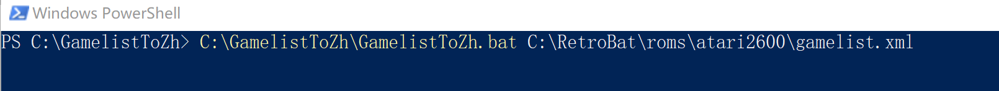

# Gamelist中文翻译工具（AI 大模型驱动版）

一个Emulation Station的gamelist.xml中文翻译脚本工具。将gamelist.xml中的英文的游戏名称和游戏描述翻译为简体中文。
主要用于对 Batocera 和 Retrobat 模拟器的gamelis.xml游戏列表文件进行中文翻译。


## 初衷：

因为最近需要整理复古怀旧游戏的ROM，没找到好用的gamelist游戏列表中文翻译软件。本人也不太懂编码，因此花费50元找计算机系的学生帮忙写了个python脚本工具，然后又花了8元买断。所以现在这个翻译脚本工具可以随意修改使用。

翻译过程截图如下：


## 功能描述：

主要用于翻译 Emulation Station 的gamelist.xml。 支持将 Batocera 和 Retrobat 模拟器的 gamelist.xml 文件中的 游戏名称 和 游戏描述 翻译为简体中文。


## 一些其他的说明

1. 首先需要你有一个AI大语言模型的账号，翻译依赖AI大模型API调用。
2. 目前支持6家：deepseek，豆包，通义千问，腾讯混元，讯飞星火，kimi。你可以随便选一家去申请个免费试用账号来使用。
3. 建议使用各家的推理模型。虽然速度比较慢但是准确率有保证。基础模型翻译速度快但对游戏名称翻译可能不准确或无法识别。
4. 推理模型翻译速度测试大概40秒左右翻译完一个游戏。比较慢，需求翻译快的可以退出换下一个工具了。
5. 翻译时默认先查database目录下面的本地中英文对照库的csv文件集，不想走本地缓存的删掉database目录内容即可。
6. database目录是本人使用deepseek推理模型，基于MAME的ROM集的跑的csv文件集合。
7. database目录下本人可能会不定期更新本地数据库(也可能不更新...）。
8. 翻译完成后，生成新的gamelist.xml。原始的gamelist.xml会在游戏目录备份。
9. 代码是买的，本人不懂技术，没有技术支持，有啥问题还请自行解决。
10. 没了

## 使用步骤：

### 1. 注册大模型API账号

首先注册你的大模型的API账号。目前支持以下几种：
deepseek，豆包，通义千问，腾讯混元，讯飞星火，kimi这6种。

### 2. 修改脚本bat配置

目前我用的话，只测试了我需要的deepseek的接入功能。

修改GamelistToZh.bat文件，将下面的配置改为自己申请的。配置完成后保存。

配置说明：

> ai：你的实际模型产品。目前支持deepseek,豆包，通义千问，腾讯混元，讯飞星火，kimi这6种
>
> model：你的实际模型名称
>
> api_key:: 你的实际API密钥

deepseek配置如下：
```
set "ai=deepseek"					                :: 请替换为你的实际模型产品
set "model=deepseek-reasoner"        			    :: 请替换为你的实际模型名称
set "api_key=xxxxxxxxxxxxxxxxxxxxxxxxxxxxxxx"  	    :: 请替换为你的实际API密钥
```

豆包火山引擎配置如下：
```
set "ai=doubao"					                    :: 请替换为你的实际模型产品
set "model=doubao-1-5-thinking-pro-250415"        	            :: 请替换为你的实际模型名称
set "api_key=xxxxxxxxxxxxxxxxxxxxxxxxxxxxxxx"  		:: 请替换为你的实际API密钥
```

通义千问配置如下：
```
set "ai=qianwen"					                :: 请替换为你的实际模型产品
set "model=qwen-max"                                :: 请替换为你的实际模型名称
set "api_key=xxxxxxxxxxxxxxxxxxxxxxxxxxxxxxx"  	    :: 请替换为你的实际API密钥
```    				

腾讯混元配置如下：
```
set "ai=hunyuan"							    	:: 请替换为你的实际模型产品
set "model=hunyuan-t1-latest"  						:: 请替换为你的实际模型名称
set "api_key=xxxxxxxxxxxxxxxxxxxxxxxxxxxxxxx"  	    :: 请替换为你的实际API密钥
```

讯飞星火配置如下：
```
set "ai=xinghuo"					    			:: 请替换为你的实际模型产品
set "model=qwen-max"    							:: 请替换为你的实际模型名称
set "api_key=xxxxxxxxxxxxxxxxxxxxxxxxxxxxxxx"  	    :: 请替换为你的实际API密钥
```

kimi配置如下：
```
set "ai=kimi"							        :: 请替换为你的实际模型产品
set "model=kimi-latest"  						:: 请替换为你的实际模型名称
set "api_key=xxxxxxxxxxxxxxxxxxxxxxxxxxxxxxx"  	:: 请替换为你的实际API密钥
```


### 3. 执行脚本翻译gamelist文件

打开Windows Powershell命令行，拖入GamelistToZh.bat脚本文件，输入空格，拖入需要翻译的gamelist.xml文件，输入回车,即可执行翻译脚本进行翻译。

翻译命令如图：



翻译结构如图：


### 4. 翻译效果

Retrobat加载翻译好的gamelist.xml文件效果如下：


截取一段原始内容和翻译后的对比

```
<game id="13983">
		<path>./dkong.zip</path>
		<name>Donkey Kong</name>
		<sortname>175 =-  Donkey Kong</sortname>
		<desc>Released in the arcades in 1981, Donkey Kong was not only Nintendo's first real smash hit for the company, but marked the introduction for two of their most popular mascots: Mario (originally "Jumpman") and Donkey Kong.
Donkey Kong is a platform-action game that has Mario scale four different industrial themed levels (construction zone, cement factory, an elevator-themed level, and removing rivets from girders) in an attempt to save the damsel in distress, Pauline, from the big ape before the timer runs out.  Once the rivets are removed from the final level, Donkey Kong falls, and the two lovers are reunited.  From there, the levels start over at a higher difficulty.
Along the way, Mario must dodge a constant stream of barrels, "living" fireballs, and spring-weights.  Although not as powerful as in other future games, Mario can find a hammer which allows him to destroy the barrels and fireballs for a limited amount of time.  Additionally, Mario can also find Pauline's hat, purse and umbrella for additional bonus points.
Donkey Kong is also notable for being one of the first complete narratives in video game form, told through simplistic cut scenes that advance the story.  It should also be noted that in versions of the game for early 1980's consoles, Donkey Kong only used 2-3 of the original levels, with the cement factory usually omitted.</desc>
		<rating>0.60</rating>
		<releasedate>19830101T000000</releasedate>
		<developer>Coleco Industries</developer>
		<publisher>CBS Electronics</publisher>
		<genre>Platform</genre>
		<genreid>257</genreid>
		<players>1</players>
	</game>
```


```
<game id="13983">
		<path>./dkong.zip</path>
		<name>大金刚</name>
		<sortname>175 =-  Donkey Kong</sortname>
		<desc>1981年，《大金刚》在街机平台发布，它不仅是任天堂公司首款真正意义上的爆款游戏，还首次引入了该公司最受欢迎的两位吉祥物：马力欧（最初名为“Jumpman”）和大金刚。
《大金刚》是一款平台动作游戏，玩家将操控马力欧攀爬四个不同的工业主题关卡（建筑工地、水泥厂、电梯主题关卡以及从大梁上移除铆钉的关卡），试图在计时器结束前从大猩猩手中救出遇险的少女宝琳。 一旦最终关卡的铆钉被全部移除，大金刚会坠落，两位恋人得以重逢。 之后，关卡将以更高难度重新开始。
途中，马力欧必须躲避源源不断的木桶、“活”火球和弹簧重物。 尽管不如后续游戏中强大，但马力欧可以找到一把锤子，在有限时间内摧毁木桶和火球。 此外，马力欧还能找到宝琳的帽子、钱包和雨伞以获得额外奖励分数。
《大金刚》还因是首批以电子游戏形式呈现完整叙事的作品之一而闻名，其通过简单的过场动画推动剧情发展。 还需注意的是，在20世纪80年代初的游戏机版本中，《大金刚》仅使用了原版中的2-3个关卡，水泥厂关卡通常被省略。</desc>
		<rating>0.60</rating>
		<releasedate>19830101T000000</releasedate>
		<developer>Coleco Industries</developer>
		<publisher>CBS Electronics</publisher>
		<genre>Platform</genre>
		<genreid>257</genreid>
		<players>1</players>
	</game>
```


